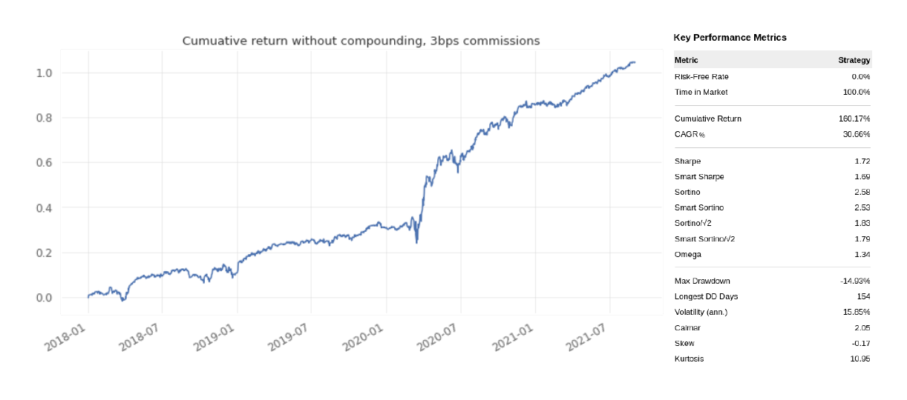
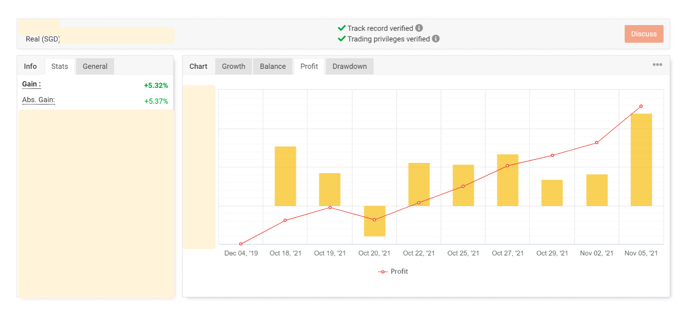

## Hey there, I'm Jeremy 
* I specialize in Natural Language Processing (NLP), Active learning & rapid annotation and Algorithmic trading
* I typically work with python, torch, SpaCy, Prodigy, transformers, AllenNLP, TimeScaleDB, elasticsearch and docker.

🔗 &nbsp;**Contact me on:**  

## Main projects
### NLP
Maybe NLP, as a whole, does not really need bigger transformers. Maybe it needs new architectures and solutions that enable models to use knowledge rapidly and reliably. I specialize in information retrieval and event extraction.   

  
  
    
  

### Data science
There has to be more to data science and machine learning than simply `magic.fit(X,y)`.  

  

### Algorithmic trading  
Active algorithmic trader since 2017. The most expensive lesson I've learnt is that that machine learning must be used in very small amounts for trading. <b>Less is more.</b>  

  
  

### Out-of-sample backtest results.   
 Equity graph is non-compounded and unleveraged. Metrics are compounded and unleveraged. Commissions included.
</a>

### Live trading results. (Verified on myfxbook.com)    
Strategy earned 5.3% over ~3 weeks from 18th Oct to 8th Nov. After which, the algorithms were integrated into my main portfolio and proceeded to earn 13.9% from 18th Oct to the rest of 2021, despite the Omicron news and expected Fed rate hikes.    </a>

</a>

 
