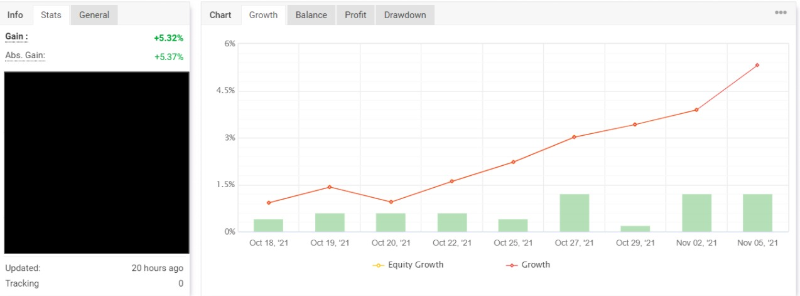

## NLP Engineer & Algorithmic Trader
 Hey there, I'm Jeremy. I specialize in:
* Natural Language Processing
* Active learning and rapid annotation
* Algorithmic trading
* Financial NLP & AI
  
I also offer freelance AI consultancy services for small businesses that want to adopt AI. 

🔗 &nbsp;**Contact me on:**  

## Main projects
### Tools for NLP:
I'm a firm believer that NLP, as a field, does not need bigger transformers. What it needs to break the current research and industry bottlenecks are new architectures and solutions that enable models to use knowledge rapidly and reliably.   

  
    
  
  
  
  

### Algorithmic trading tools:
Active algorithmic trader since 2017. I believe algorithmic trading is part common sense, part engineering, with only a pinch of data mining.  

  
  

</a>

 
